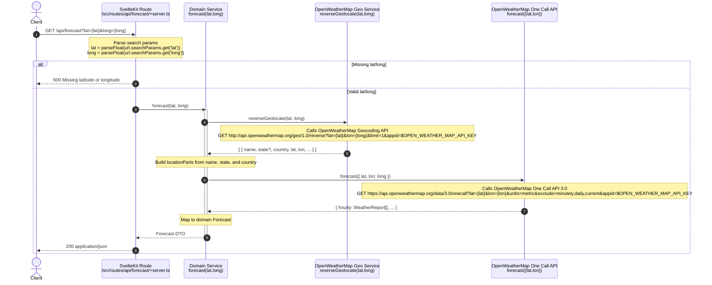

# Forecast API Request Flow

This diagram shows the flow of a request hitting the SvelteKit API handler at `/api/forecast` and all methods/services it calls along the way.

Key files and functions referenced:
- API handler: `src/routes/api/forecast/+server.ts`
  - Exports `GET: RequestHandler`
  - Parses `lat` and `long` from query, validates, returns `json(result)`
- Domain forecast: `src/lib/domain/forecast.ts`
  - `forecast(lat: number, long: number)`
  - Calls `reverseGeolocate` then `openWeatherMap.forecast`
- OpenWeatherMap services:
  - `src/lib/openWeatherMap/geolocate.ts`
    - `reverseGeolocate(lat: number, long: number)` → OWM Geocoding API
  - `src/lib/openWeatherMap/forecast.ts`
    - `forecast({ lat, lon })` → OWM One Call 3.0 API with `units=metric`
  - `src/lib/openWeatherMap/index.ts` (barrel exports)
- Environment:
  - Uses `$env/static/private.OPEN_WEATHER_MAP_API_KEY` for both API calls

Error behavior:
- If `lat` or `long` is missing or cannot be parsed to a truthy number, the handler throws `error(500, 'Missing latitude or longitude')`.

Notes:
- Units are hardcoded to `metric` in One Call request (TODO in code mentions allowing selection).
- Reverse geolocation result uses a limit of 1 and builds a human-readable `locationName` from name/state/country.
